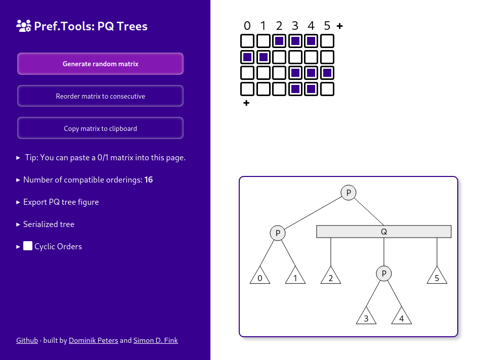

# pqtree.js

An [emscripten](https://emscripten.org/)/WebAssembly version of
the [UFPC implementation](https://github.com/N-Coder/pc-tree/) of
the [Hsu-McConnell algorithm](https://doi.org/10.1016/S0304-3975(02)00435-8) for
producing [PQ-/PC-trees](https://en.wikipedia.org/wiki/PQ_tree) for the (circular) consecutive ones problem.
See the paper "[Experimental Comparison of PC-Trees and PQ-Trees](https://arxiv.org/abs/2106.14805)" by Fink et al. for
more details on this implementation.
This project was initiated by [Dominik Peters](https://dominik-peters.de),
with some updates by [Simon D. Fink](https://github.com/N-Coder).

## Graphical Online Version available at [n-coder.github.io/pqtree.js](https://n-coder.github.io/pqtree.js)

[](n-coder.github.io/pqtree.js)

The online version is also automatically built by [CI](../../actions).

## Build from Source

To build the emscripten version, assuming emscripten is installed so `emcc` is callable:

```shell
./build.sh
```

Use it as follows in HTML:

```HTML
<script src="libPCTree.js"></script>
<script>
    var Module = {
        onRuntimeInitialized: function () {
            const is_circular = false; // use linear orders and PQ-trees
                                       // (instead of cyclic orders and PC-trees)
            Module.setRestrictions("001010\n011010\n011101", is_circular); // returns true
            Module.setRestrictions("11000\n00110\n11110\n10101", is_circular); // returns false
        }
    };
</script>
```

Function `setRestrictions` returns `true` if an order exists and the corresponding tree has been stored in internal
state,
or `false` if no such order exists and the internal state has been cleared.
See the further methods in [glue.cpp](./wasm/glue.cpp) for methods for querying the tree stored in internal state.
